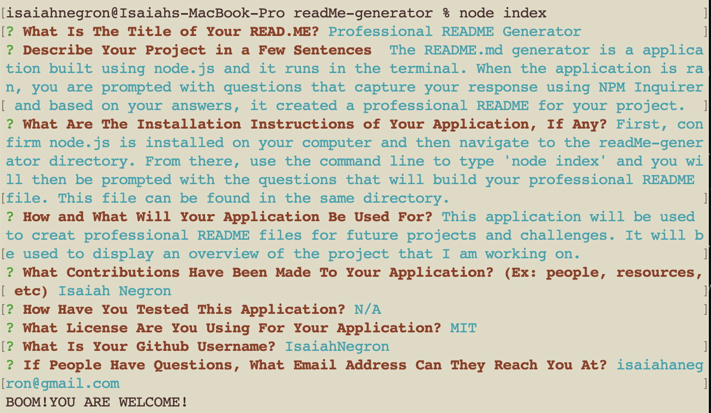

# Professional README Generator

  

  ## Description
  The README generator is a application built using node.js and it runs in the terminal. When the application is ran, you are prompted with questions that capture your response using NPM Inquirer and based on your answers, it created a professional README for your project.

  ## Table of Contents
  - [Description](#Description)
  - [Installation Instructions](#Installation)
  - [Usage](#Usage)
  - [Contributions](#Contributions)
  - [Testing](#Tests)
  - [License](#License)
  - [Github](#Github)
  - [Contact](#Contact)

  ## Installation Instructions
  First, confirm node.js is installed on your computer and then navigate to the readMe-generator directory. From there, use the command line to type 'node index' and you will then be prompted with the questions that will build your professional README file. This file can be found in the same directory.

  ## Usage
   This application will be used to create professional README files for future projects and challenges. It will be used to display an overview of the project that I am working on.

  ## ScreenShot
  

  ## Contributions
  Isaiah Negron

  ## Testing
  N/A

  ## License
  
   
  Permission to use this application is granted under the MIT License. <https://opensource.org/licenses/MIT>

  ## Github Username
  Lets Connect: IsaiahNegron

  ## Contact
  If you have any questions feel free to contact me at <a href='mailto:isaiahanegron@gmail.com'>isaiahanegron@gmail.com</a>